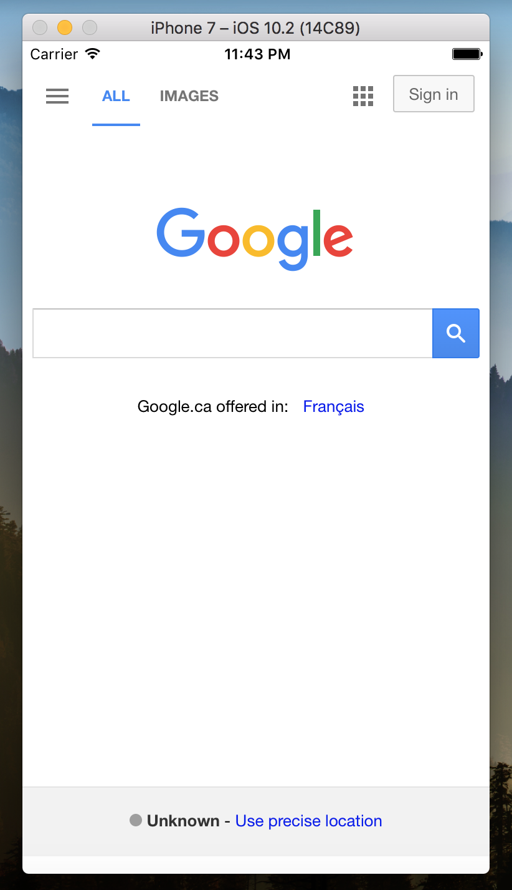
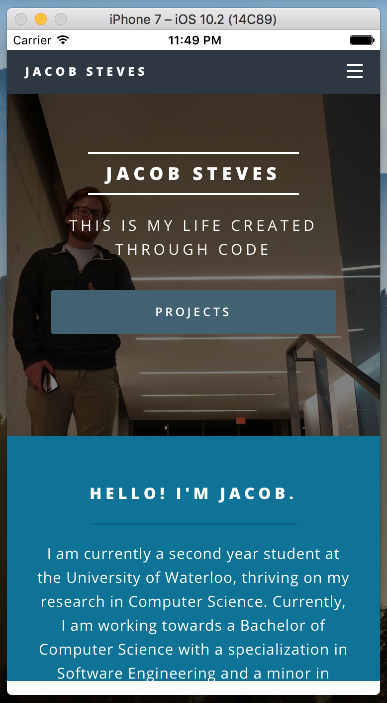
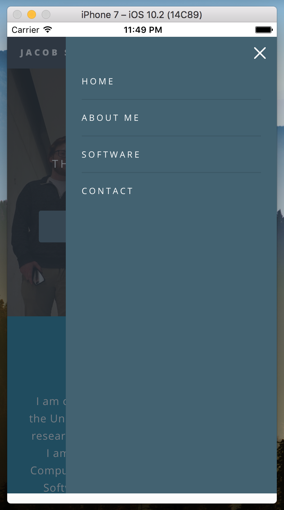
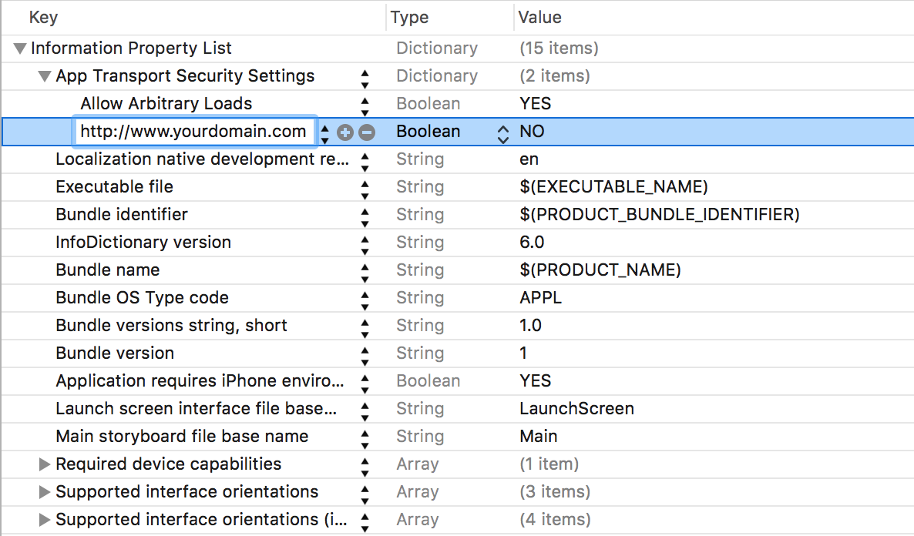

# Swift-Webviewer
Turn any website into an iOS application. 

#### Notice
The iOS app store will reject any application that is simply a website. So if you want to use this repo for that purpose, then you may want to rethink your project. You can easily build upon this framework to make something cool with your site that deserves to be on the store.

## Demo
### Google

### Portfolio Website
 

## Installation
- clone this repo
- open the `SwiftWebviewer` folder within Xcode
- edit the Bundle Identifier `SwiftWebviewer/SwiftWebviewer/Info.plist` to your own and generate a new signing profile / add your own
- edit the `SwiftWebviewer/SwiftWebviewer/ViewController.swift` to use the site you want
- edit the `SwiftWebviewer/SwiftWebviewer/Info.plist` to arbitrarily load your domain
     - 
